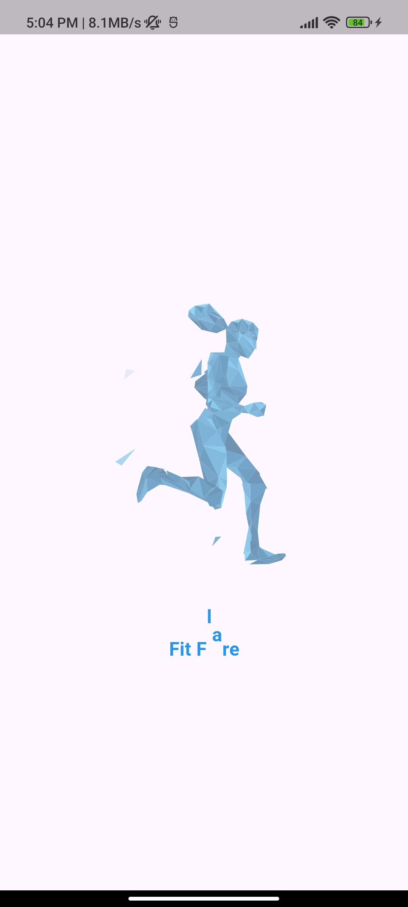
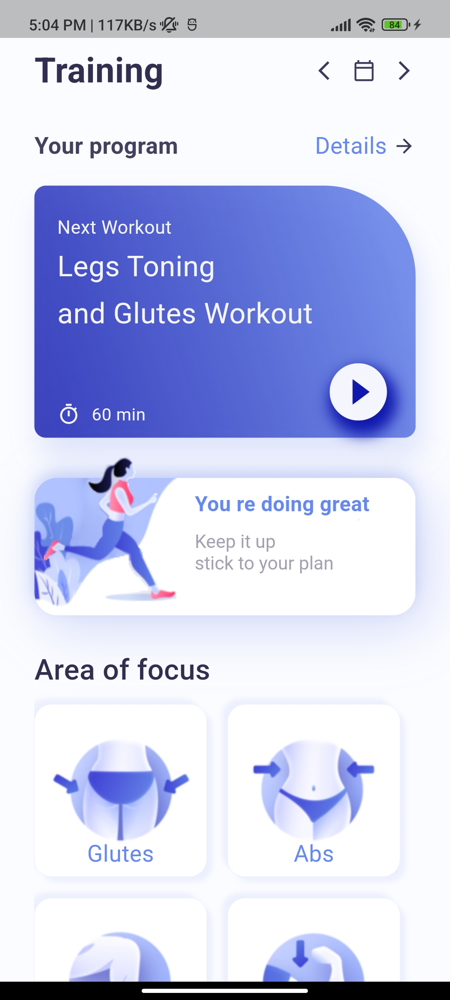
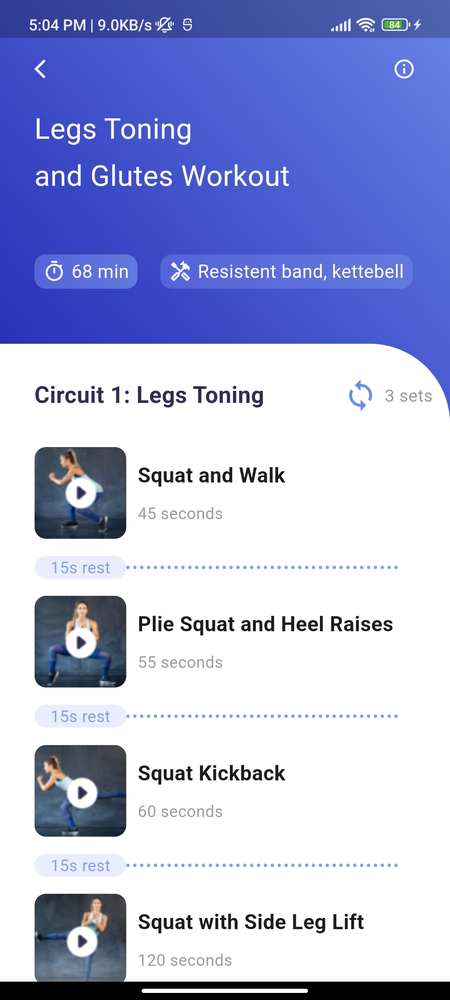
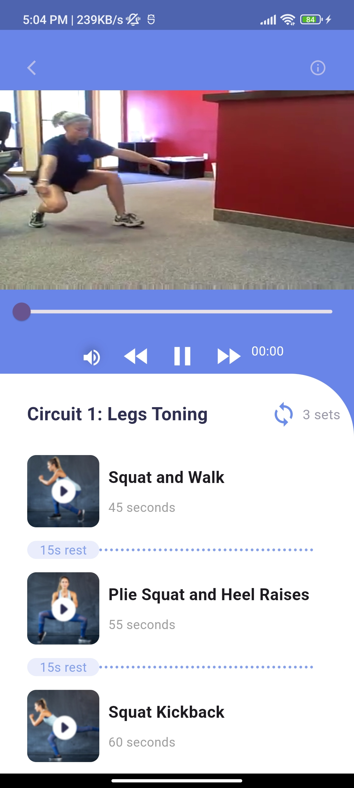

# Fit Flare

**Fit Flare** is a fitness tutorial app built using **Flutter** and **GetX** for state management. The app provides users with an interactive experience to explore different exercise types, view tutorial videos, and control playback with intuitive buttons.

## Features

- **Splash Screen**: An animated splash screen that welcomes users upon app startup.
- **Home Page**: Displays a list of exercise types that users can explore.
- **Details Page**: Shows a list of exercise tutorial videos in a scrollable `ListView`.
- **Video Playback**: Users can play, pause, and navigate between videos using next and previous buttons. The video player is fully functional, built with the `video_player` package.

## Screenshots

  
  &nbsp;&nbsp;&nbsp;&nbsp;&nbsp;&nbsp;&nbsp;&nbsp;
  
  &nbsp;&nbsp;&nbsp;&nbsp;&nbsp;&nbsp;&nbsp;&nbsp;
  
  &nbsp;&nbsp;&nbsp;&nbsp;&nbsp;&nbsp;&nbsp;&nbsp;
  

## Technologies Used

- **Flutter**: Framework for building the mobile app.
- **GetX**: For state management and route handling.
- **video_player**: Package for video playback with controls (play, pause, next, and previous).
- **Dart**: Programming language for app development.
